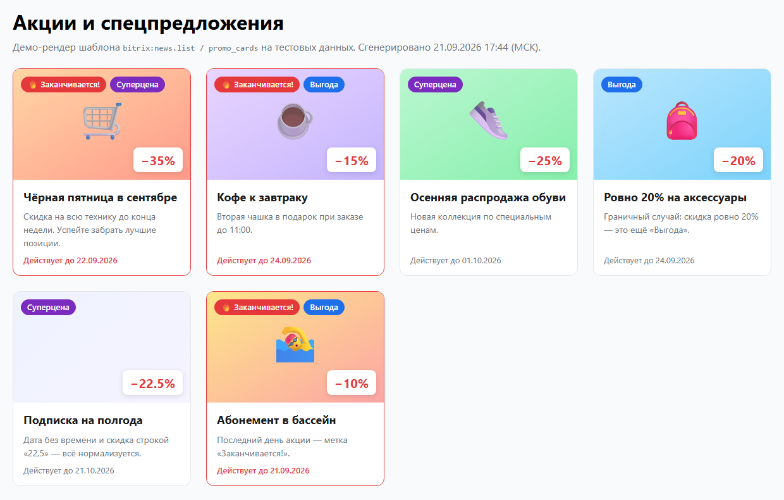

# Блок «Акции и спецпредложения» — шаблон `promo_cards` для `bitrix:news.list`

Тестовое задание: [pragma-dev-company/bitrix-test-task](https://github.com/pragma-dev-company/bitrix-test-task/blob/main/test-task.md).

**Демо:** https://maxicids.github.io/bitrix-promo-cards/ — настоящие `result_modifier.php` и `template.php`, отрендеренные в GitHub Actions на тестовых данных (без установки CMS).



## Структура (от корня сайта)

```
/
├── local/templates/.default/components/bitrix/news.list/promo_cards/
│   ├── .description.php      # название шаблона в визуальном редакторе
│   ├── result_modifier.php   # IS_HOT, BADGE, нормализация скидки, ресайз картинки
│   ├── template.php          # разметка карточек
│   ├── style.css             # стили (подключаются ядром автоматически)
│   └── lang/{ru,en}/...      # языковые фразы
├── promo/index.php           # пример страницы с вызовом компонента
└── demo/                     # НЕ для сайта: заглушки ядра, тест и демо-рендер
```

Почему `/local/templates/.default/...`:

- `/local/` — место для кастомизаций, не затрагивается обновлениями ядра (в отличие от `/bitrix/`);
- `.default` — шаблон доступен из любого шаблона сайта. Если блок нужен только в одном дизайне, папку можно перенести в `/local/templates/<шаблон_сайта>/components/bitrix/news.list/promo_cards/` — Битрикс ищет её там в первую очередь.

## Что сделано

**`result_modifier.php`** — для каждого элемента `$arResult['ITEMS']`:

| Ключ | Логика |
|---|---|
| `IS_HOT` | `true`, если до окончания акции осталось больше 0 и **меньше 3 × 24 ч**. Закончившиеся акции — `false`. |
| `BADGE` | «Суперцена», если скидка **строго больше 20%**, иначе «Выгода» (в т. ч. ровно 20% и пустая скидка). Перекрывает значение свойства, как требует ТЗ. |
| `BADGE_CODE` | `super` / `default` — модификатор CSS-класса бейджа, чтобы не дублировать условие в шаблоне. |
| `DISCOUNT_PERCENT` | Число (`float`) или `null`; понимает `"22,5"`, `"25%"`. |
| `ACTIVE_TO_TIMESTAMP` | Дата окончания в timestamp — для вывода «Действует до». |
| `CARD_PICTURE` | Картинка анонса, уменьшенная `CFile::ResizeImageGet` до 640×400. |

Дата окончания берётся из свойства `DATE_ACTIVE_TO`, а если оно пустое — из стандартного поля элемента «Окончание активности» (`FIELD_CODE = DATE_ACTIVE_TO`). Если в дате нет времени, акция считается действующей до 23:59:59 этого дня.

**`template.php`** — карточка: картинка анонса, название (ссылка на детальную, с учётом `HIDE_LINK_WHEN_NO_DETAIL`), краткое описание, процент скидки, бейдж `BADGE`, красный бейдж «🔥 Заканчивается!» при `IS_HOT`, дата окончания. Поддержаны эрмитаж (кнопки редактирования/удаления в публичной части) и постраничная навигация. Все тексты — в языковых файлах.

**`style.css`** — адаптивная сетка на CSS Grid, карточки, бейджи, плашка скидки; у «горящих» акций красная рамка.

## Важный нюанс: кеш

`result_modifier.php` выполняется **до** сохранения `$arResult` в кеш компонента, поэтому `IS_HOT` вычисляется в момент построения кеша и «замораживается» на `CACHE_TIME`. При суточном кеше акция может получить метку «Заканчивается!» с опозданием до суток.

В примере `promo/index.php` выставлен `CACHE_TIME = 3600` (погрешность не больше часа). Если нужна точность до минуты — варианты: вынести расчёт в `component_epilog.php` + JS, либо пересчитывать бейдж на клиенте по `<time datetime>`. Это вопрос к заказчику (см. ниже).

## Как проверить

**На сайте с 1С-Битрикс:**

1. Скопировать `local/` в корень сайта (и при желании `promo/`).
2. В инфоблоке «Акции» завести свойства `DISCOUNT_PERCENT` (число), `BADGE` (строка) и либо свойство `DATE_ACTIVE_TO` (дата/время), либо заполнять поле «Окончание активности».
3. В `promo/index.php` указать `IBLOCK_TYPE` / `IBLOCK_ID` — или выбрать шаблон `promo_cards` у любого `news.list` в визуальном редакторе.

**Без Битрикса (нужен PHP 8+):**

```bash
php demo/test.php                       # 14 проверок логики IS_HOT / BADGE
php -S localhost:8000 demo/render.php   # демо-страница на http://localhost:8000
```

## Уточняющие вопросы заказчику

1. **`DATE_ACTIVE_TO` — свойство или стандартное поле «Окончание активности»?** В ТЗ оно в таблице свойств, но у элемента есть поле с таким же кодом. Сейчас поддерживаются оба варианта, приоритет у свойства.
2. **«Менее 3 дней»** — это меньше 72 часов до окончания (как реализовано) или «осталось 0–2 календарных дня»? Для акции, заканчивающейся через 3 дня в 00:00, ответы разные.
3. **Свойство `BADGE`** по ТЗ всегда перезаписывается расчётным значением — тогда контент-менеджеру его заполнять бессмысленно. Может, использовать ручное значение как приоритетное, а расчёт — только если свойство пустое?
4. **Скидка ровно 20%** — «Выгода» (по ТЗ «больше 20%»). Верно?
5. **Закончившиеся акции** — скрывать (`CHECK_DATES = Y`, как сейчас) или показывать с пометкой «Акция завершена»?
6. **Актуальность `IS_HOT` и кеш** — достаточно точности в пределах `CACHE_TIME` (час) или нужна точность до минуты?
7. Акции без скидки — показывать без плашки процента (как сейчас) или не выводить вовсе?
